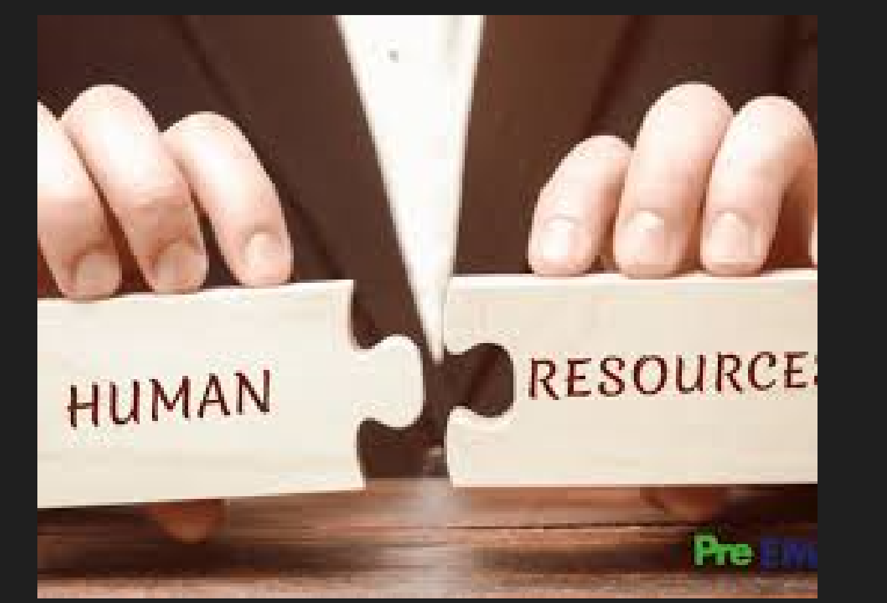

# IBM-HR-Analytics-Project

**Introduction** : 

I decided to play around with an HR Dataset called **IBM Data Science Datasets** the insights gotten from these datasets are not real. It was intended to practice my skills using Power Query, Power BI and DAX. What interests me most about these Report is the part where i wrote different DAX to gain meaningful insights from the Data, and the familiarity with some HR terms commonly used. I ma going to be taking us along every process that was done,even the littlest of it :cowboy_hat_face: that became meaningful Insights and in turn made me come up with a fascinating Report!

**_Disclaimer_**

This project is not in any way a real life project. _The dataset is a dummy Dataset that is intended to practice the capabilities of PowerBI and DAX_ Now lets jump right in :collision:

**Skills demostrated**
