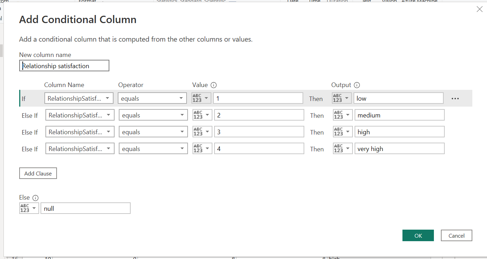

# IBM-HR-Analytics-Project

**Introduction** : 

I decided to play around with an HR Dataset  **IBM Data Science Datasets** the insights gotten from these datasets are not real. It was intended to practice my skills using Power Query, Power BI and DAX. What interests me most about this Report is the part where i wrote different DAX to gain meaningful insights from the Data, and the familiarity with some HR terms commonly used. I am going to be taking us along every process that was done,even to the littlest of processes done :cowboy_hat_face: that became meaningful Insights and in turn made me come up with a fascinating Report!

**_Disclaimer_**

This project is not in any way a real life project. _The dataset is a dummy Dataset that is intended to practice the capabilities of PowerBI and DAX_. Now lets jump right in :collision:

**Data Description**

The Dataset consists of 1470 rows,

**Problems Statement**

1. The dataset contained more of numerical values that needed to be adjusted in order to gain meaningful insights.
2. There was an Attrition column that contained a Yes/No value. In order to gain meaningful insights from it, i needed to apply a measure that will help in deriving the total percentage of employees that have left the organization. 
3. The Age column in the dataset was grouped into Age ranges of 4 categories in order to derive meaningful insights from it.

However, this documentation will cover every step that i carried out to ensure that i derive and gain meaningful Insights from the Dataset, not only to have a beautiful Report but for better understanding of the Data.

**Skills Demostrated**
- DAX
- Page Navigation
- Filters
- Buttons
- New Measures

**Modelling**: The Dataset is only a table, so there was no need for Data Modeling because there is no table that i was going to model it against.

**Visualization**

The report comprises of 3 pages which includes:
- Overview Page
- Action Page
- Attrition Page

**Data Manipulation/Transformation Process**

**Education Column, Environmental satisfaction, Job involvement, Job satisafaction, Performance rating, Relationship satisfaction, Work life balance**. 

These contained Data enteries that were recorded in numerical form, and i needed to change it to a text form in order to gain meaningful insights from it when visualizing. A conditional column statement was applied here. I am going to attach images of the Before Columns and the Conditional statement that i wrote to change the numerical information to text values.

Below is an image of what the columns looked like before Transformation :point_down:

**Column 1**                                   | **Column 2**
:----------------------------------------------|:--------------------------------
                                    |              

The Conditional statements that was written is as follows;

**1**                                       |                   **2**             
:-------------------------------------------|:--------------------------------------
                                 |

**3**                                       |                   **4**             
:-------------------------------------------|:--------------------------------------
                                 |

**5**                                       |                   **6**             
:-------------------------------------------|:--------------------------------------
                                 |

Finally, let me now jump right into the main body of work that consumed a lot of time and also involved critical thinking:see_no_evil:

After the Conditional statements, the next on the list is to group my Age column into different categories in order to gain insights.Below is the IF statement that was written. The Age bracket includes ages between 18-60. 

1.** Age Column**

Age range = IF(HR_Info[Age]>=18&&HR_Info[Age]<=20,"Under age",IF(HR_Info[Age]>=21&&HR_Info[Age]<=30,"Middle age",IF(HR_Info[Age]>=31&&HR_Info[Age]<=40,"Mature age",IF(HR_Info[Age]>=41&&HR_Info[Age]<=50,"Senior age","old age"))))

2. **Employee Count**

I wanted to know the total number of Employees that is in the Dataset. A DAX measure was created to get this.

Total Employee = COUNTROWS(HR_Info)

3. **Male/Female Column**

The dataset contained a Gender column. I wanted to know the total number of Males and Females in the dataset so Measures were created in respect to this in order to gain Insights. More like we have to filter our dataset to calculate the total number of Males and Females in the Organization.

Female = CALCULATE([Total Employee],HR_Info[Gender]="Female") 
Male = CALCULATE([Total Employee],HR_Info[Gender]="Male")

4. **Attrition Column**

This column contained a YES/NO information. I wanted to know the percentage of Employees that have left the Organization. DAX measures were applied in order to get this information.

Attrition Rate = DIVIDE(COUNTROWS(FILTER('HR_Info', 'HR_Info'[Attrition] = "Yes")), COUNTROWS('HR_Info'))

5. **Years_since last Promotion Column**

Informations in this column were in numerical form, i did not like the way it appeared because i obviously would notbe able to gain any insights from it. So i decided to use a Conditional Statement that will categorize my values into 3 different statements. Below is a snippet of what the Before and After transformation looked like.

Before                                           | After
:---------------------------------------------|:-----------------------------------------------
                                       | 

The Final output after the conditional statement is below	:sunglasses:

.png)

6. **Distance from Home Column** 

This column contained numerical values as well that mere looking at it, one wouldnt think any meaningful information was going to be derived from it. A Conditional statement was also written which changed the numeric values to text form. Below is an image showing Transformation processes.

Distance from Home                             | Distance Status
:-------------------------------------|:----------------------------------------
                                |

Indeed a lot of beautiful insights can be gotten from this Dataset, if only one is able to calm down, relax and think :monocle_face:

7. **Years at Company** 

Here, values in the dataset were numeric and it looked like i was not going to get any meaningful information from it. So i decided to use a Column from Example function,which turned the before column into  meaningful information and in turn i added text values to corroborate the previous information and i also gave it a new Column name. The Column from Example function works like a flashfill, once a value is true it automatically recognizes other values and it fills it down. see below 	:point_down:	 

Years at company                         | Service years
:----------------------------------------|:-----------------------------------------------
                                    |

There we have it:wink:i can visualize my Service years column against other metrics and it will give me more meaningful insights.

**Job Levels** 
This Column contained numerical values, this error could occur as a result of wrong Data entry.I needed to gain more insights from the Column, so i decided to use the Column from Example function to retrieve the initial values and still add texts values to corroborate it. We already know how the Column from example works:innocent: Below is the Transformation process

Before                                  | After
:---------------------------------------|:--------------------------------------
                                   |               

Looks like we are done:relieved: Now let us **Visualize our Data** 

